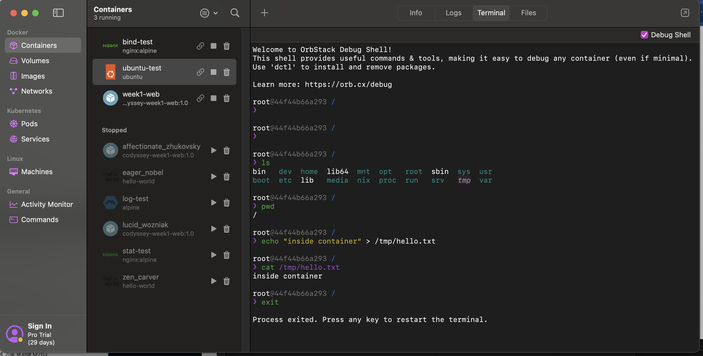
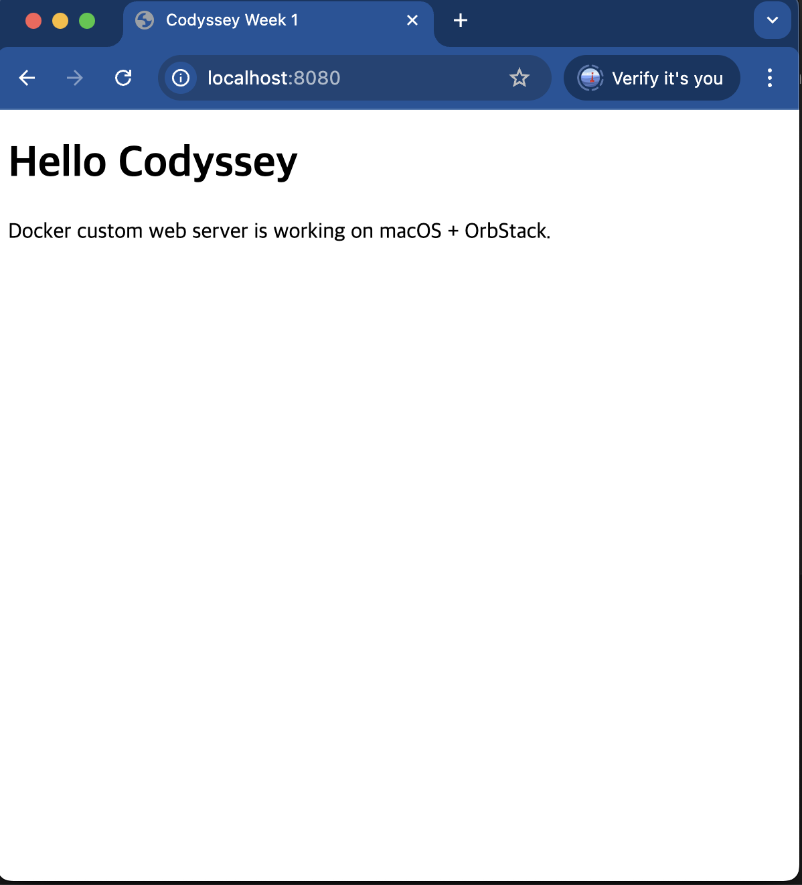
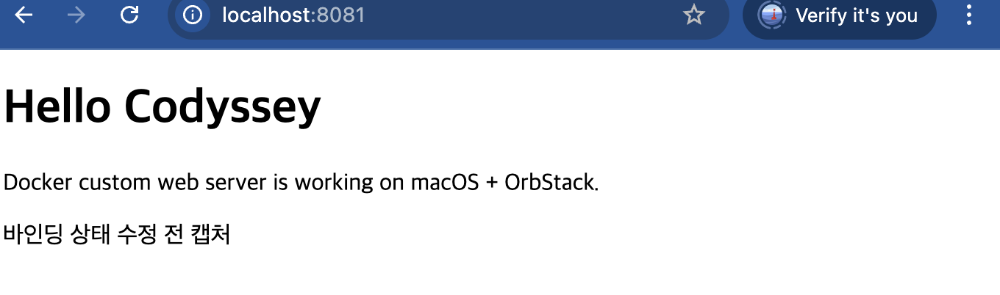
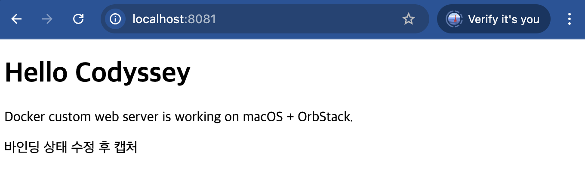
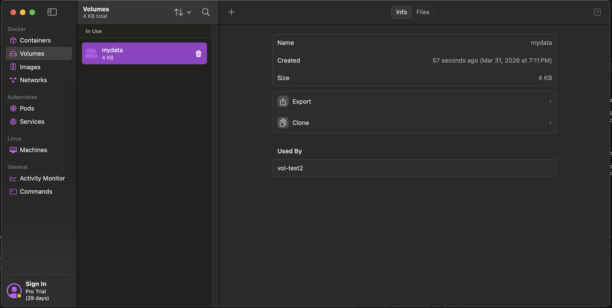

# Codyssey 1주차 - AI/SW 개발 워크스테이션 구축

## 1. 프로젝트 개요

## 1. 프로젝트 개요

## 1. 프로젝트 개요

이번 과제에서는 iMac(macOS) 환경에서 OrbStack을 실행한 뒤, 터미널(CLI) 기반으로 개발 워크스테이션을 구성했다.  
터미널 기본 조작, 권한 변경 실습, Docker 설치/점검, 컨테이너 실행, Dockerfile 기반 커스텀 웹 서버 구축, 포트 매핑 검증, bind mount 반영 확인, volume 영속성 검증, Git/GitHub/VSCode 연동까지 수행했다.  
추가로 보너스 과제로 Docker Compose의 기본 구조와 단일/멀티 컨테이너 실행 방식, 운영 명령어, 환경 변수 활용, GitHub SSH 키 설정 개념까지 함께 정리했다.

---

## 2. 실행 환경

- Host OS: macOS
- Device: iMac
- Shell: zsh
- Docker Engine: OrbStack
- Docker Version: 28.5.2
- Git Version: 2.53.0
- Working Directory: `/Users/guswnd0432389/Desktop/ia-codyssey`
- GitHub Repository: `https://github.com/stnguswnd/ia-codyssey`

---

## 3. 제출물 구성 및 구조 설계 기준

```text
ia-codyssey/
├─ README.md
├─ Dockerfile
├─ app/
│  └─ index.html
└─ screenshots/
```

### 3-1. 구조 설계 기준

- `README.md`  
  전체 수행 절차, 실행 명령, 결과, 개념 설명, 트러블슈팅을 한 곳에 모으는 **단일 기준 문서(single source of truth)** 로 두었다.

- `Dockerfile`  
  빌드 명령 `docker build -t codyssey-week1-web:1.0 .` 를 루트에서 바로 실행할 수 있도록 **프로젝트 루트**에 배치했다.  
  이렇게 하면 build context가 단순해지고, `app/` 폴더를 상대 경로로 바로 참조할 수 있다.

- `app/`  
  실제 웹 서버가 제공할 정적 파일만 분리했다.  
  실행 대상 파일과 문서/증빙 파일을 섞지 않기 위해 `index.html` 을 별도 디렉토리로 분리했다.

- `screenshots/`  
  실행 결과 증빙 이미지를 모으는 폴더다.  
  런타임 파일(`app/`)과 평가 증빙 파일(`screenshots/`)을 분리해, **서비스 파일과 제출 증거를 역할별로 구분**했다.

### 3-2. 왜 이 구조가 적절한가

- 실행에 필요한 파일과 설명 문서를 분리해 가독성이 좋다.
- Docker build 시 필요한 파일 위치가 단순해 실수 가능성이 줄어든다.
- `app/` 은 bind mount 실습에도 그대로 재사용 가능하다.
- 제출자가 아닌 다른 사람이 저장소를 열어도 폴더 역할을 바로 이해할 수 있다.

---

## 4. 수행 체크리스트

- [x] 터미널 기본 조작 및 폴더 구성
- [x] 파일/디렉토리 권한 변경 실습
- [x] Docker 설치 및 기본 점검
- [x] Docker 기본 명령 수행 (`images`, `ps`, `ps -a`, `logs`, `stats`)
- [x] `hello-world` 실행
- [x] `ubuntu` 컨테이너 내부 명령 실행
- [x] Dockerfile 기반 커스텀 이미지 작성
- [x] 이미지 빌드 및 컨테이너 실행
- [x] 포트 매핑 검증
- [x] Bind Mount 반영 검증
- [x] Volume 영속성 검증
- [x] Git 사용자 설정 및 GitHub/VSCode 연동
- [x] 트러블슈팅 정리
- [x] 민감정보 마스킹 확인
- [x] Docker Compose 기본 구조 확인
- [x] Docker Compose 단일 서비스 실행 방식 정리
- [x] Docker Compose 멀티 컨테이너 개념 확인
- [x] Docker Compose 운영 명령어 정리 (`up`, `down`, `ps`, `logs`)
- [x] 환경 변수 활용 방식 정리
- [x] GitHub SSH 키 설정 개념 확인

---

## 5. 개념 및 설계 정리

### 5-1. 절대 경로와 상대 경로

- 절대 경로: `/Users/guswnd0432389/Desktop/ia-codyssey`
- 상대 경로: `./app`, `./screenshots`, `.`

절대 경로는 루트(`/`)부터 시작하는 전체 경로이고, 상대 경로는 현재 위치를 기준으로 해석되는 경로다.

#### 어떤 상황에서 무엇을 선택했는가

- **절대 경로를 쓰는 경우**
  - 현재 내가 어느 위치에 있는지 명확히 확인할 때
  - 호스트 OS 기준의 실제 위치를 설명해야 할 때
  - bind mount처럼 **호스트 경로 자체가 중요**한 상황을 설명할 때

- **상대 경로를 쓰는 경우**
  - 저장소 루트 기준으로 누구나 같은 명령을 재현하게 만들고 싶을 때
  - 문서 이식성(portability)을 높이고 싶을 때
  - `docker build -t codyssey-week1-web:1.0 .`, `COPY app/ ...`, `./screenshots/...` 처럼 **프로젝트 내부 리소스**를 참조할 때

#### 판단 기준

- **현재 폴더가 바뀌어도 의미가 유지되어야 하면 절대 경로**
- **저장소를 통째로 옮겨도 명령이 유지되어야 하면 상대 경로**

즉, 이번 과제에서는  
경로 개념 설명과 호스트 위치 확인에는 절대 경로를 쓰고,  
실제 실행 명령과 제출 구조 설명에는 상대 경로를 우선 사용했다.

### 5-2. 권한 의미 정리

- `r`: read
- `w`: write
- `x`: execute

예시:
- `644` = 소유자 `rw-`, 그룹 `r--`, 기타 사용자 `r--`
- `755` = 소유자 `rwx`, 그룹 `r-x`, 기타 사용자 `r-x`

숫자 뜻:
- `4` = 읽기(`r`)
- `2` = 쓰기(`w`)
- `1` = 실행(`x`)

그래서:
- `6 = 4 + 2 = rw-`
- `5 = 4 + 1 = r-x`
- `7 = 4 + 2 + 1 = rwx`

일반적으로 파일은 `644`, 디렉토리는 `755` 형태를 많이 사용한다.  
파일은 보통 소유자만 수정하면 충분하고, 디렉토리는 접근을 위해 `x` 권한이 필요하기 때문이다.

### 5-3. Git과 GitHub 차이

- Git: 로컬 환경에서 버전 이력을 관리하는 도구
- GitHub: 원격 저장소 및 협업 플랫폼

즉, Git은 버전 관리 자체이고, GitHub는 그 이력을 공유하고 백업하는 원격 공간이다.

### 5-4. 이미지(Image)와 컨테이너(Container) 차이

#### 빌드 관점

- **이미지(Image)** 는 Dockerfile을 기준으로 만들어지는 **불변(immutable) 실행 템플릿**이다.
- `docker build -t codyssey-week1-web:1.0 .` 의 결과물은 이미지다.
- 이 시점에는 웹 서버가 아직 실행되지 않는다.

#### 실행 관점

- **컨테이너(Container)** 는 이미지를 실제로 실행한 **런타임 인스턴스**다.
- `docker run -d --name week1-web -p 8080:80 codyssey-week1-web:1.0` 의 결과는 컨테이너다.
- 같은 이미지로도 여러 개의 컨테이너를 만들 수 있다.

#### 변경 관점

- 이미지 자체는 빌드 후 그대로 유지된다.
- 컨테이너는 실행 중 상태, 로그, writable layer 등 **실행 시점의 변화**를 가진다.
- `app/index.html` 이나 Dockerfile을 바꿨다면 **이미지를 다시 빌드**해야 한다.
- 반대로 bind mount를 사용하면 컨테이너를 다시 빌드하지 않고도 호스트 파일 수정이 즉시 반영될 수 있다.
- 컨테이너 내부에만 저장한 데이터는 컨테이너 삭제 시 사라질 수 있으므로, 영속 데이터는 **volume 또는 bind mount** 로 분리해야 한다.

### 5-5. 포트 매핑이 필요한 이유

컨테이너는 호스트와 분리된 **독립 네트워크 네임스페이스(network namespace)** 를 가진다.  
따라서 컨테이너 내부의 nginx가 `80` 포트에서 듣고 있어도, 그 포트는 기본적으로 **컨테이너 내부에서만 열려 있는 상태**다.

즉,
- nginx는 컨테이너 안에서 `80` 포트에 바인딩됨
- 브라우저는 호스트(macOS)의 네트워크로 접속함
- 따라서 아무 설정이 없으면 호스트의 `localhost:80` 과 컨테이너의 `80` 은 자동으로 연결되지 않음

이때 `-p 8080:80` 을 사용하면,
- 호스트의 `8080`
- 컨테이너의 `80`

을 연결해 주는 포트 포워딩/NAT 규칙이 생긴다.

그래서 브라우저에서 `http://localhost:8080` 으로 접속하면,  
호스트 8080으로 들어온 요청이 컨테이너 내부 nginx 80으로 전달된다.

정리하면, **포트 매핑은 호스트와 컨테이너의 분리된 네트워크를 이어주는 공개 창구**다.

### 5-6. Bind Mount와 Volume 차이

- **Bind Mount**
  - 호스트의 실제 디렉토리를 컨테이너에 직접 연결
  - 예: `-v "$(pwd)/app:/usr/share/nginx/html"`
  - 장점: 호스트 파일 수정이 즉시 반영됨
  - 적합한 경우: 소스 코드, 설정 파일, 실시간 편집이 필요한 웹 리소스

- **Volume**
  - Docker가 관리하는 별도 영속 저장 공간
  - 예: `-v mydata:/data`
  - 장점: 컨테이너를 삭제해도 데이터 유지가 쉬움
  - 적합한 경우: DB 데이터, 업로드 파일, 컨테이너 수명과 분리해 보존할 데이터

### 5-7. 재현 가능하도록 설계한 기준

이번 README는 단순히 “한 번 실행했다”는 기록이 아니라, **제3자가 같은 결과를 반복해서 재현할 수 있게** 작성했다.

#### 설계 기준

- **고정된 이미지 태그 사용**  
  `codyssey-week1-web:1.0` 으로 태그를 고정해, run 시 어떤 이미지를 써야 하는지 모호하지 않게 했다.

- **고정된 컨테이너 이름 사용**  
  `week1-web`, `bind-test`, `vol-test`, `vol-test2` 처럼 역할이 드러나는 이름을 사용했다.

- **포트 충돌 방지용 분리**
  - 커스텀 웹 서버: `8080 -> 80`
  - bind mount 검증: `8081 -> 80`

  같은 nginx 계열 실습이라도 포트를 분리해 충돌 없이 각각 재현할 수 있게 했다.

- **런타임 데이터와 정적 파일의 역할 분리**
  - 정적 웹 파일: `app/`
  - 영속 데이터: `mydata` volume

  즉, **코드/정적 자원과 데이터 저장소를 अलग-अलग 관리**하도록 구성했다.

- **검증 명령과 실행 명령을 쌍으로 배치**
  - 실행: `docker run ...`
  - 검증: `docker ps`, `curl`, `docker exec`, `docker logs`

  각 단계마다 “실행”과 “확인”을 함께 두어, 재현 과정에서 어느 지점이 실패했는지 바로 파악할 수 있게 했다.

---

## 6. 수행 로그

### 6-1. 작업 폴더 생성

#### 실행 명령

```bash
mkdir -p ./codyssey-week1/app ./codyssey-week1/screenshots
cd ~/codyssey-week1
touch README.md Dockerfile app/index.html
git init
git branch -M main
```

#### 실행 결과

```text
guswnd0432389@c3r4s3 desktop % mkdir -p ./codyssey-week1/app ./codyssey-week1/screenshots
guswnd0432389@c3r4s3 desktop % cd ~/codyssey-week1
guswnd0432389@c3r4s3 codyssey-week1 % touch README.md Dockerfile app/index.html
git init
git branch -M main

hint: Using 'master' as the name for the initial branch. This default branch name
hint: will change to "main" in Git 3.0. To configure the initial branch name
hint: to use in all of your new repositories, which will suppress this warning,
hint: call:
hint:
hint: 	git config --global init.defaultBranch <name>
hint:
hint: Names commonly chosen instead of 'master' are 'main', 'trunk' and
hint: 'development'. The just-created branch can be renamed via this command:
hint:
hint: 	git branch -m <name>
hint:
hint: Disable this message with "git config set advice.defaultBranchName false"
Initialized empty Git repository in /Users/guswnd0432389/codyssey-week1/.git/

guswnd0432389@c3r4s3 codyssey-week1 % ls
Dockerfile    README.md    app    screenshots
```

#### 정리

- 프로젝트 루트, 정적 웹 파일 폴더, 캡처 폴더를 먼저 분리했다.
- 제출용 문서와 실행 대상 파일을 초기에 구조화해 이후 실습이 꼬이지 않도록 했다.

---

### 6-2. 터미널 기본 조작

#### 실행 명령

```bash
pwd
ls
ls -la

mkdir practice
cd practice

touch a.txt
echo "hello codyssey" > a.txt
cat a.txt

mkdir dir1
cp a.txt dir1/
mv a.txt b.txt
mv b.txt dir1/c.txt

ls -la
cd ..
rm -r practice    (r은 recursive로 폴더 안을 모두 삭제)
```

#### 실행 결과

```text
guswnd0432389@c3r4s3 codyssey-week1 % pwd
/Users/guswnd0432389/codyssey-week1

guswnd0432389@c3r4s3 codyssey-week1 % ls
Dockerfile    README.md    app    screenshots

guswnd0432389@c3r4s3 codyssey-week1 % ls -la
total 0
drwxr-xr-x   7 guswnd0432389  guswnd0432389  224 Mar 31 14:41 .
drwxr-x---+ 24 guswnd0432389  guswnd0432389  768 Mar 31 14:44 ..
drwxr-xr-x   9 guswnd0432389  guswnd0432389  288 Mar 31 14:41 .git
-rw-r--r--   1 guswnd0432389  guswnd0432389    0 Mar 31 14:41 Dockerfile
-rw-r--r--   1 guswnd0432389  guswnd0432389    0 Mar 31 14:41 README.md
drwxr-xr-x   3 guswnd0432389  guswnd0432389   96 Mar 31 14:41 app
drwxr-xr-x   2 guswnd0432389  guswnd0432389   64 Mar 31 14:40 screenshots

guswnd0432389@c3r4s3 codyssey-week1 % mkdir practice
guswnd0432389@c3r4s3 codyssey-week1 % cd practice
guswnd0432389@c3r4s3 practice % touch a.txt
guswnd0432389@c3r4s3 practice % echo "hello codyssey" > a.txt

guswnd0432389@c3r4s3 practice % cat a.txt
hello codyssey

guswnd0432389@c3r4s3 practice % mkdir
usage: mkdir [-pv] [-m mode] directory_name ...

guswnd0432389@c3r4s3 practice % mkdir dir1
guswnd0432389@c3r4s3 practice % cp a.txt dir1/
guswnd0432389@c3r4s3 practice % mv a.txt b.txt
guswnd0432389@c3r4s3 practice % mv b.txt dir1/c.txt

guswnd0432389@c3r4s3 practice % ls -la
total 0
drwxr-xr-x  3 guswnd0432389  guswnd0432389   96 Mar 31 14:46 .
drwxr-xr-x  8 guswnd0432389  guswnd0432389  256 Mar 31 14:44 ..
drwxr-xr-x  4 guswnd0432389  guswnd0432389  128 Mar 31 14:46 dir1
guswnd0432389@c3r4s3 practice % cd ..
guswnd0432389@c3r4s3 codyssey-week1 % rm -r practice
```

#### 정리

- `pwd` 로 현재 위치 확인
- `ls`, `ls -la` 로 일반 파일/숨김 파일 확인
- `mkdir`, `touch`, `cp`, `mv`, `rm` 으로 기본 파일 조작 수행
- `cat` 으로 파일 내용 확인

---

### 6-3. 권한 변경 실습

#### 실행 명령

```bash
touch perm.txt
mkdir permdir

ls -l
ls -ld permdir

chmod 644 perm.txt
chmod 755 permdir

ls -l
ls -ld permdir
```

#### 실행 결과

```text
guswnd0432389@c3r4s3 ia-codyssey % touch perm.txt
guswnd0432389@c3r4s3 ia-codyssey % mkdir permdir

guswnd0432389@c3r4s3 ia-codyssey % ls -l
total 48
-rw-r--r--  1 guswnd0432389  guswnd0432389    203 Mar 31 14:35 Dockerfile
-rw-r--r--@ 1 guswnd0432389  guswnd0432389  16954 Mar 31 15:53 README.md
drwxr-xr-x  3 guswnd0432389  guswnd0432389     96 Mar 31 14:35 app
-rw-r--r--  1 guswnd0432389  guswnd0432389      0 Mar 31 17:22 perm.txt
drwxr-xr-x  2 guswnd0432389  guswnd0432389     64 Mar 31 17:22 permdir

guswnd0432389@c3r4s3 ia-codyssey % ls -ld permdir
drwxr-xr-x  2 guswnd0432389  guswnd0432389  64 Mar 31 17:22 permdir

guswnd0432389@c3r4s3 ia-codyssey % chmod 644 perm.txt
guswnd0432389@c3r4s3 ia-codyssey % chmod 755 permdir

guswnd0432389@c3r4s3 ia-codyssey % ls -l
total 48
-rw-r--r--  1 guswnd0432389  guswnd0432389    203 Mar 31 14:35 Dockerfile
-rw-r--r--@ 1 guswnd0432389  guswnd0432389  16954 Mar 31 15:53 README.md
drwxr-xr-x  3 guswnd0432389  guswnd0432389     96 Mar 31 14:35 app
-rw-r--r--  1 guswnd0432389  guswnd0432389      0 Mar 31 17:22 perm.txt
drwxr-xr-x  2 guswnd0432389  guswnd0432389     64 Mar 31 17:22 permdir

guswnd0432389@c3r4s3 ia-codyssey % ls -ld permdir
drwxr-xr-x  2 guswnd0432389  guswnd0432389  64 Mar 31 17:22 permdir
```

#### 정리

- `perm.txt` 에 `644` 권한 적용
- `permdir` 에 `755` 권한 적용
- 파일과 디렉토리는 권한 해석 방식이 다르므로, `ls -l` 과 `ls -ld` 를 구분해 확인했다.

---

### 6-4. Docker 설치 및 기본 점검

#### 실행 명령

```bash
docker --version
```

#### 실행 결과

```text
guswnd0432389@c3r4s3 ~ % docker --version
Docker version 28.5.2, build ecc6942
```

#### 정리

- OrbStack 실행 후 터미널에서 `docker` 명령이 정상 동작함을 확인했다.
- Docker Engine 연결 상태와 기본 정보를 점검했다.

---

### 6-5. Docker 기본 명령 수행

#### 실행 명령

```bash
docker run hello-world
docker images
docker ps -a

docker run --name log-test alpine sh -c "echo hello from container"
docker logs log-test

docker run -d --name stat-test nginx:alpine
docker ps
docker stats --no-stream
docker rm -f stat-test
```

#### 실행 결과

```text
guswnd0432389@c3r4s3 ~ % docker run hello-world

Hello from Docker!
This message shows that your installation appears to be working correctly.

To generate this message, Docker took the following steps:
 1. The Docker client contacted the Docker daemon.
 2. The Docker daemon pulled the "hello-world" image from the Docker Hub.
    (amd64)
 3. The Docker daemon created a new container from that image which runs the
    executable that produces the output you are currently reading.
 4. The Docker daemon streamed that output to the Docker client, which sent it
    to your terminal.

To try something more ambitious, you can run an Ubuntu container with:
 $ docker run -it ubuntu bash

guswnd0432389@c3r4s3 ~ % docker images
REPOSITORY           TAG       IMAGE ID       CREATED        SIZE
codyssey-week1-web   1.0       6358d2477bfb   5 hours ago    62.2MB
nginx                alpine    d5030d429039   6 days ago     62.2MB
hello-world          latest    e2ac70e7319a   7 days ago     10.1kB
ubuntu               latest    f794f40ddfff   5 weeks ago    78.1MB
alpine               latest    a40c03cbb81c   2 months ago   8.44MB

guswnd0432389@c3r4s3 ~ % docker ps -a
CONTAINER ID   IMAGE                    COMMAND                  CREATED             STATUS                      PORTS                                     NAMES
5518d9b24c09   hello-world              "/hello"                 15 seconds ago      Exited (0) 15 seconds ago                                             xenodochial_moore
4f24e79fc9f9   ubuntu                   "sleep infinity"         45 minutes ago      Up 45 minutes                                                         vol-test2
44f44b66a293   ubuntu                   "bash"                   About an hour ago   Up About an hour                                                      ubuntu-test
94000698c879   nginx:alpine             "/docker-entrypoint.…"   2 hours ago         Up 2 hours                  0.0.0.0:8081->80/tcp, [::]:8081->80/tcp   bind-test
38f14a1f344a   codyssey-week1-web:1.0   "/docker-entrypoint.…"   2 hours ago         Up 2 hours                  0.0.0.0:8080->80/tcp, [::]:8080->80/tcp   week1-web
0303e003cee4   hello-world              "/hello"                 2 hours ago         Exited (0) 2 hours ago                                                eager_nobel
3ff3628ceaa0   codyssey-week1-web:1.0   "/docker-entrypoint.…"   4 hours ago         Exited (0) 2 hours ago                                                affectionate_zhukovsky
d5124d00d2ac   codyssey-week1-web:1.0   "/docker-entrypoint.…"   4 hours ago         Created                                                               lucid_wozniak
7191eec7147a   alpine                   "sh -c 'echo hello f…"   5 hours ago         Exited (0) 5 hours ago                                                log-test
e2aa75e607e7   hello-world              "/hello"                 5 hours ago         Exited (0) 5 hours ago                                                zen_carver

guswnd0432389@c3r4s3 ~ % docker run --name log-test alpine sh -c "echo hello from container"
docker: Error response from daemon: Conflict. The container name "/log-test" is already in use by container "7191eec7147a6e4580b15aa232302e29ee21c8cb3886df5704294d968596da97". You have to remove (or rename) that container to be able to reuse that name.

Run 'docker run --help' for more information

guswnd0432389@c3r4s3 ~ % docker rm -f log-test
log-test

guswnd0432389@c3r4s3 ~ % docker run --name log-test alpine sh -c "echo hello from container"
hello from container

guswnd0432389@c3r4s3 ~ % docker logs log-test
hello from container

guswnd0432389@c3r4s3 ~ % docker rm -f stat-test
Error response from daemon: No such container: stat-test

guswnd0432389@c3r4s3 ~ % docker run -d --name stat-test nginx:alpine
b3c6c996db6cb85750efdf48aa4f21eade1e7c899c1aaad3ab77bc04cf0e19dc

guswnd0432389@c3r4s3 ~ % docker ps
CONTAINER ID   IMAGE                    COMMAND                  CREATED             STATUS             PORTS                                     NAMES
b3c6c996db6c   nginx:alpine             "/docker-entrypoint.…"   4 seconds ago       Up 3 seconds       80/tcp                                    stat-test
4f24e79fc9f9   ubuntu                   "sleep infinity"         53 minutes ago      Up 53 minutes                                                vol-test2
44f44b66a293   ubuntu                   "bash"                   About an hour ago   Up About an hour                                             ubuntu-test
94000698c879   nginx:alpine             "/docker-entrypoint.…"   2 hours ago         Up 2 hours         0.0.0.0:8081->80/tcp, [::]:8081->80/tcp   bind-test
38f14a1f344a   codyssey-week1-web:1.0   "/docker-entrypoint.…"   2 hours ago         Up 2 hours         0.0.0.0:8080->80/tcp, [::]:8080->80/tcp   week1-web

guswnd0432389@c3r4s3 ~ % docker stats --no-stream
CONTAINER ID   NAME          CPU %     MEM USAGE / LIMIT     MEM %     NET I/O           BLOCK I/O         PIDS
b3c6c996db6c   stat-test     0.00%     13.78MiB / 15.67GiB   0.09%     830B / 126B       8.75MB / 4.1kB    7
4f24e79fc9f9   vol-test2     0.00%     96KiB / 15.67GiB      0.00%     1.3kB / 126B      0B / 0B           1
44f44b66a293   ubuntu-test   0.00%     628KiB / 15.67GiB     0.00%     10.6kB / 2.13kB   27MB / 73.7kB     1
94000698c879   bind-test     0.00%     5.051MiB / 15.67GiB   0.03%     14kB / 8.08kB     15.6MB / 8.19kB   7
38f14a1f344a   week1-web     0.00%     5.062MiB / 15.67GiB   0.03%     5.55kB / 2.98kB   13.3MB / 8.19kB   7
```

#### 정리

- `hello-world` 로 Docker 설치/실행 경로를 검증했다.
- `docker images` 로 로컬 이미지 목록을 확인했다.
- `docker ps`, `docker ps -a` 로 실행 중/종료된 컨테이너 상태를 구분해 확인했다.
- `docker logs` 로 컨테이너 로그를 확인했다.
- `docker stats --no-stream` 으로 실행 중인 컨테이너 리소스 사용량을 점검했다.

---

### 6-6. 컨테이너 실습 (`ubuntu`)

#### 실행 명령

```bash
docker run -it --name ubuntu-test ubuntu bash
```

컨테이너 내부에서:

```bash
ls
pwd
echo "inside container" > /tmp/hello.txt
cat /tmp/hello.txt
exit
```

#### 실행 결과

```text
guswnd0432389@c3r4s3 ~ % docker run -it --name ubuntu-test ubuntu bash
Unable to find image 'ubuntu:latest' locally
latest: Pulling from library/ubuntu
817807f3c64e: Pull complete
Digest: sha256:186072bba1b2f436cbb91ef2567abca677337cfc786c86e107d25b7072feef0c
Status: Downloaded newer image for ubuntu:latest
```



#### 정리

- 이미지는 실행 기반 템플릿이고, 컨테이너는 실제 실행 인스턴스임을 실습으로 확인했다.
- 컨테이너 내부 파일시스템은 호스트(macOS)와 분리되어 있다.
- 컨테이너 안에서 생성한 `/tmp/hello.txt` 는 호스트에 자동으로 나타나지 않는다.

---

### 6-7. Dockerfile 기반 커스텀 웹 서버

#### 선택한 베이스 이미지

`nginx:alpine` 을 선택했다.

선택 이유:
- 정적 웹 서버 구성에 적합함
- 설정이 단순함
- 이미지 크기가 작아 실습용으로 가볍고 빠름

#### Dockerfile 내용

```dockerfile
FROM nginx:alpine
LABEL org.opencontainers.image.title="codyssey-week1-web"
LABEL org.opencontainers.image.description="Codyssey week1 custom nginx image"
ENV APP_ENV=dev
COPY app/ /usr/share/nginx/html/
```

#### 웹 파일 내용 (`app/index.html`)

```html
<!DOCTYPE html>
<html lang="ko">
  <head>
    <meta charset="UTF-8" />
    <meta name="viewport" content="width=device-width, initial-scale=1.0" />
    <title>Codyssey Week 1</title>
  </head>
  <body>
    <h1>Hello Codyssey</h1>
    <p>Docker custom web server is working on macOS + OrbStack.</p>
  </body>
</html>
```

#### 빌드/실행 명령

```bash
docker build -t codyssey-week1-web:1.0 .
docker run -d --name week1-web -p 8080:80 codyssey-week1-web:1.0
docker ps
docker logs week1-web
curl http://localhost:8080
```

#### 실행 결과

```text
guswnd0432389@c3r4s3 ia-codyssey % docker build -t codyssey-week1-web:1.0 .
[+] Building 0.5s (7/7) FINISHED
 => [internal] load build definition from Dockerfile                                                                 0.1s
 => [internal] load metadata for docker.io/library/nginx:alpine                                                      0.0s
 => [internal] load .dockerignore                                                                                    0.1s
 => [internal] load build context                                                                                    0.1s
 => [1/2] FROM docker.io/library/nginx:alpine                                                                        0.0s
 => CACHED [2/2] COPY app/ /usr/share/nginx/html/                                                                    0.0s
 => exporting to image                                                                                               0.0s
 => => writing image sha256:6358d2477bfb441efe33b59d7c2c7a6886308fc4f7348b6e2f34a3aee5f13d0a                        0.0s
 => => naming to docker.io/library/codyssey-week1-web:1.0                                                            0.0s

guswnd0432389@c3r4s3 ia-codyssey % docker run -d --name week1-web -p 8080:80 codyssey-week1-web:1.0
38f14a1f344a0b2be6ae5ddcc0f390eaa98b4494787907fcb794af608766b3f1

guswnd0432389@c3r4s3 ia-codyssey % docker ps
CONTAINER ID   IMAGE                    COMMAND                  CREATED         STATUS         PORTS                                     NAMES
38f14a1f344a   codyssey-week1-web:1.0   "/docker-entrypoint.…"   7 seconds ago   Up 6 seconds   0.0.0.0:8080->80/tcp, [::]:8080->80/tcp   week1-web

guswnd0432389@c3r4s3 ia-codyssey % docker logs week1-web
/docker-entrypoint.sh: /docker-entrypoint.d/ is not empty, will attempt to perform configuration
/docker-entrypoint.sh: Looking for shell scripts in /docker-entrypoint.d/
...
2026/03/31 08:50:39 [notice] 1#1: nginx/1.29.7
2026/03/31 08:50:39 [notice] 1#1: start worker processes

guswnd0432389@c3r4s3 ia-codyssey % curl http://localhost:8080
<!DOCTYPE html>
<html lang="ko">
  <head>
    <meta charset="UTF-8" />
    <meta name="viewport" content="width=device-width, initial-scale=1.0" />
    <title>Codyssey Week 1</title>
  </head>
  <body>
    <h1>Hello Codyssey</h1>
    <p>Docker custom web server is working on macOS + OrbStack.</p>
  </body>
</html>
```

#### 정리

- 기존 웹 서버 이미지를 기반으로 커스텀 이미지를 생성했다.
- `COPY app/ /usr/share/nginx/html/` 로 정적 파일을 이미지에 포함시켰다.
- 빌드 성공 후 컨테이너 실행, 로그 확인, HTTP 응답 확인까지 이어서 검증했다.

---

### 6-8. 포트 매핑 검증

#### 실행 명령

```bash
docker run -d --name week1-web -p 8080:80 codyssey-week1-web:1.0
curl http://localhost:8080
```

#### 실행 결과

포트 매핑 결과는 6-7의 `docker ps` 와 `curl` 결과로 확인했다.

```text
0.0.0.0:8080->80/tcp
```

```html
<h1>Hello Codyssey</h1>
<p>Docker custom web server is working on macOS + OrbStack.</p>
```

#### 브라우저 접속 증거

주소창이 보이도록 브라우저에서 `http://localhost:8080` 접속 후 캡처했다.



#### 설계 관점 정리

- 컨테이너 내부 nginx의 기본 포트는 `80` 이므로 컨테이너 포트를 `80` 으로 고정했다.
- 호스트 포트는 실습 검증용으로 기억하기 쉬운 `8080` 을 사용했다.
- `week1-web` 이라는 고정된 컨테이너 이름을 사용해 `docker ps`, `docker logs`, `docker rm -f week1-web` 로 후속 조작이 쉽도록 했다.
- 즉, 포트 매핑은 단순 실행이 아니라, **누가 봐도 재실행 가능한 형태**로 이름/포트/검증 URL을 함께 정한 것이다.

#### 정리

- 호스트 포트 `8080` 을 컨테이너 포트 `80` 에 연결했다.
- 브라우저와 `curl` 모두에서 접속을 확인했다.
- 포트 매핑은 호스트 네트워크와 컨테이너 네트워크를 연결하는 필수 단계다.

---

### 6-9. Bind Mount 반영 검증

#### 실행 명령

```bash
docker run -d --name bind-test -p 8081:80 \
  -v "$(pwd)/app:/usr/share/nginx/html" \
  nginx:alpine

curl http://localhost:8081
```

이후 `app/index.html` 내용을 수정한 뒤 다시 확인:

```bash
curl http://localhost:8081
```

#### 실행 결과

```text
guswnd0432389@c3r4s3 ia-codyssey % docker run -d --name bind-test -p 8081:80 \
  -v "$(pwd)/app:/usr/share/nginx/html" \
  nginx:alpine
94000698c8797bfc248ae4dcec33bdc083e05ad65bbc6a2154d55eaa4c0622da
```

#### 수정 전 캡처



#### 수정 후 캡처



#### 설계 관점 정리

- `$(pwd)/app` 는 **호스트의 실제 작업 디렉토리**를 가리킨다.
- `/usr/share/nginx/html` 은 nginx 기본 웹 루트다.
- 즉, 호스트의 `app/` 폴더를 컨테이너 웹 루트에 그대로 연결해, 로컬 파일 변경이 즉시 웹 응답으로 이어지도록 설계했다.
- 포트는 6-8의 웹 서버와 충돌하지 않도록 `8081` 로 분리했다.
- 이 구성은 “이미지 재빌드 없이 반영되는 개발 방식”을 검증하기 위한 재현 가능한 실험 설계다.

#### 정리

- 호스트의 `app/` 디렉토리를 컨테이너 웹 루트에 직접 연결했다.
- 호스트 파일 수정 후 컨테이너 내부 웹 페이지에도 즉시 반영되는 것을 확인했다.
- 정적 파일을 자주 수정하는 개발 단계에서는 bind mount가 특히 유용하다.

---

### 6-10. Volume 영속성 검증

#### 실행 명령

```bash
docker volume create mydata

docker run -d --name vol-test -v mydata:/data ubuntu sleep infinity
docker exec -it vol-test bash -lc "echo hi > /data/hello.txt && cat /data/hello.txt"

docker rm -f vol-test   (f는 force의 약자로 실행중인 컨테이너도 강제로 종료한 뒤 삭제, 만약 안쓴다면 docker stop vol-test후 docker rm vol-test로 삭제해야함) 

docker run -d --name vol-test2 -v mydata:/data ubuntu sleep infinity
docker exec -it vol-test2 bash -lc "cat /data/hello.txt"
```

#### 실행 결과

```text
guswnd0432389@c3r4s3 ~ % docker volume create mydata
mydata

guswnd0432389@c3r4s3 ~ % docker run -d --name vol-test -v mydata:/data ubuntu sleep infinity
a0351093d1a50f7073d11f7ab7dd49a2f1a050decbc352b338dd06f516960928

guswnd0432389@c3r4s3 ~ % docker exec -it vol-test bash -lc "echo hi > /data/hello.txt && cat /data/hello.txt"
hi

guswnd0432389@c3r4s3 ~ % docker rm -f vol-test
vol-test

guswnd0432389@c3r4s3 ~ % docker run -d --name vol-test2 -v mydata:/data ubuntu sleep infinity
4f24e79fc9f9e59378946db1cefefd01678ca7837c5ebb43b57d5e72fb24cd89

guswnd0432389@c3r4s3 ~ % docker exec -it vol-test2 bash -lc "cat /data/hello.txt"
hi
```



#### 설계 관점 정리

- 볼륨 이름을 `mydata` 로 명시해 컨테이너 생명주기와 분리된 저장소임을 드러냈다.
- 첫 번째 컨테이너(`vol-test`)와 두 번째 컨테이너(`vol-test2`) 모두 같은 `/data` 경로로 연결해 비교 조건을 동일하게 맞췄다.
- 컨테이너는 삭제했지만, 볼륨은 삭제하지 않았기 때문에 두 번째 컨테이너에서 같은 파일을 다시 읽을 수 있었다.
- 즉, 이 실습은 “컨테이너 삭제”와 “데이터 삭제”가 같은 의미가 아님을 재현 가능한 방식으로 검증한다.

#### 정리

- `mydata` 볼륨을 생성했다.
- 첫 번째 컨테이너에서 파일 생성 후 컨테이너를 삭제했다.
- 두 번째 컨테이너에서 같은 파일이 유지되는 것을 확인했다.
- 이를 통해 Docker Volume의 영속성을 검증했다.

---

### 6-11. 보너스 과제 (선택)

#### 6-11-1. Docker Compose 기초

Docker Compose는 여러 컨테이너의 실행 설정을 `compose.yaml` 파일에 선언하고,
`docker compose up` 명령으로 한 번에 실행·관리할 수 있게 해주는 도구다.
반복적으로 길게 입력하던 `docker run` 명령을 파일로 관리할 수 있어, 재현성과 관리성이 높아진다.

이번 실습에서는 **COPY 방식 이미지 실행용 서비스**와 **Bind Mount 방식 실시간 반영 서비스**를 각각 Compose로 구성했다.

#### 파일 내용 (`compose.yaml`)

```yaml
services:
  web-copy:
    build:
      context: .
      dockerfile: Dockerfile
    image: codyssey-week1-web:1.0
    ports:
      - "8080:80"

  web-bind:
    build:
      context: .
      dockerfile: Dockerfile.bind
    image: codyssey-week1-bind:1.0
    ports:
      - "${HOST_PORT}:80"
    volumes:
      - ./app-bind:/usr/share/nginx/html
```

#### 정리

* `web-copy`: Dockerfile 기반으로 이미지를 빌드하고, 호스트 `8080`을 컨테이너 `80`에 매핑
* `web-bind`: `Dockerfile.bind` 기반으로 이미지를 빌드하고, 환경변수 `HOST_PORT`를 통해 포트 설정
* `./app-bind` 디렉토리를 컨테이너 웹 루트에 bind mount 하여 파일 수정 사항이 즉시 반영되도록 구성

#### 배운 점

* 단일 컨테이너라도 실행 설정을 파일로 관리하면 반복 실행이 쉬워진다.
* `docker run` 명령을 직접 기억하는 방식보다 설정 파일 기반 관리가 더 재현 가능하다.

---

#### 6-11-2. Compose로 COPY 방식과 Bind Mount 방식 분리

이번 Compose 파일은 단순히 여러 컨테이너를 띄우는 것보다,
**정적 파일을 이미지에 포함하는 방식**과 **호스트 파일을 실시간 연결하는 방식**을 비교할 수 있도록 구성했다.

#### 구성 의도

* `web-copy`

  * `COPY app/ /usr/share/nginx/html/` 방식
  * 이미지 빌드 시점의 정적 파일이 컨테이너에 포함됨
  * 파일을 수정하면 다시 `docker build`가 필요함

* `web-bind`

  * `volumes: - ./app-bind:/usr/share/nginx/html` 방식
  * 호스트 디렉토리를 컨테이너에 직접 연결
  * 파일 수정 사항이 즉시 반영됨
  * 개발 및 실시간 확인에 적합함

#### 배운 점

* COPY 방식은 **배포용 이미지 고정**에 적합하다.
* Bind Mount 방식은 **개발 중 빠른 수정·확인**에 적합하다.
* 같은 nginx 기반 서비스라도 파일 반영 방식에 따라 운영 목적이 달라질 수 있음을 확인했다.

---

#### 6-11-3. Compose 실행 및 운영 명령어

Compose에서는 다음 명령으로 전체 서비스를 한 번에 실행, 확인, 종료할 수 있다.

#### 실행 명령

```bash
docker compose up -d
docker compose ps
docker compose logs
docker compose down
```

#### 명령 의미

* `docker compose up -d`

  * `compose.yaml`에 정의된 서비스를 백그라운드에서 실행
* `docker compose ps`

  * Compose 프로젝트에 포함된 컨테이너 상태 확인
* `docker compose logs`

  * 각 서비스 로그 확인
* `docker compose down`

  * Compose로 생성한 컨테이너, 네트워크 등을 정리하며 종료

#### 배운 점

* `docker run`, `docker stop`, `docker rm`을 각각 수행하던 흐름을 하나의 프로젝트 단위로 관리할 수 있다.
* 운영 관점에서 `up → ps → logs → down` 흐름을 익혀두면 멀티 컨테이너 환경을 더 체계적으로 다룰 수 있다.

---

#### 6-11-4. 환경 변수 활용

Compose에서는 포트, 모드, 경로 등 변경 가능성이 높은 설정값을 환경 변수로 분리할 수 있다.
이번 실습에서는 `web-bind` 서비스의 호스트 포트를 환경 변수로 분리했다.

#### Compose 설정 일부

```yaml
ports:
  - "${HOST_PORT}:80"
```

#### 환경 변수 파일 예시 (`.env`)

```env
HOST_PORT=8081
```

#### 적용 의미

* 컨테이너 내부 포트 `80`은 그대로 유지
* 호스트 포트만 `.env`에서 변경 가능
* 예를 들어 `HOST_PORT=8081`, `HOST_PORT=8082`처럼 상황에 맞게 쉽게 조정 가능

#### 배운 점

* 환경 변수는 코드와 설정을 분리하는 기본 방법이다.
* 같은 Compose 파일을 유지하면서도 실행 환경에 따라 다른 포트를 적용할 수 있어 유연하다.
* 포트 충돌이 발생할 때도 Compose 파일을 직접 수정하지 않고 `.env`만 바꿔 대응할 수 있다.

---

#### 6-11-5. Compose 기반 실행 구조 정리

이번 Compose 파일은 아래 두 가지 실행 방식을 비교하기 쉽게 구성했다.

| 서비스        | 목적             | 파일 반영 방식        | 포트                |
| ---------- | -------------- | --------------- | ----------------- |
| `web-copy` | 배포형 정적 웹 서버 검증 | 이미지 빌드 시 `COPY` | `8080:80`         |
| `web-bind` | 개발형 실시간 반영 검증  | `Bind Mount`    | `${HOST_PORT}:80` |

#### 설계 기준

* **배포/고정 결과 확인**이 목적일 때는 `web-copy`
* **파일 수정 후 즉시 반영 확인**이 목적일 때는 `web-bind`

즉, 이번 Compose 구성은 단순 실행 자동화가 아니라
**이미지 기반 배포 방식과 로컬 개발 방식의 차이**를 한 파일 안에서 비교 가능하게 만드는 것을 목표로 했다.

#### 배운 점

* Compose는 여러 컨테이너를 띄우는 도구이기도 하지만,
  서로 다른 실행 전략을 문서화하는 도구로도 활용할 수 있다.
* 서비스 목적에 따라 `build`, `ports`, `volumes`, `.env`를 어떻게 조합할지 설계하는 것이 중요하다.

---
#### 6-11-6. GitHub SSH 키 설정

GitHub 원격 저장소에 접근하는 방식에는 대표적으로 **HTTPS**와 **SSH**가 있다.
HTTPS 방식은 웹 접속과 동일한 프로토콜을 사용하며, `git push`, `git pull` 등의 작업 시 사용자 인증이 필요하다. 최근에는 비밀번호 대신 **Personal Access Token(PAT)** 을 사용하는 경우가 많다.
반면 SSH 방식은 로컬 PC에서 생성한 **SSH 키 쌍(공개 키, 개인 키)** 을 기반으로 인증하며, GitHub 계정에 공개 키를 등록하면 해당 PC를 신뢰된 장치로 인식하여 반복적인 인증 입력 없이 원격 저장소를 사용할 수 있다.

이번 실습에서는 `ed25519` 방식으로 SSH 키를 생성하고, 공개 키를 확인하여 GitHub 계정에 등록한 뒤, `ssh -T git@github.com` 명령으로 GitHub와 SSH 연결이 정상적으로 되는지 테스트했다.
또한 `git remote -v` 명령으로 현재 저장소의 원격 주소가 **HTTPS인지 SSH인지 확인**하고, 필요 시 HTTPS 주소를 SSH 주소로 변경해야 실제 `git push`, `git pull`에 SSH 인증 방식이 적용된다는 점도 확인했다.

특히 SSH 설정은 단순히 키를 생성하는 것으로 끝나는 것이 아니라,

1. SSH 키 생성
2. 공개 키 확인 및 GitHub 등록
3. SSH 인증 테스트
4. 현재 Git 저장소의 remote 주소 확인
5. 필요 시 HTTPS → SSH 주소 변경

까지 이어져야 실제 Git 작업에 정상적으로 활용할 수 있다는 점을 이해했다.

#### HTTPS와 SSH의 차이

| 구분    | HTTPS                              | SSH                            |
| ----- | ---------------------------------- | ------------------------------ |
| 인증 방식 | 아이디/토큰 기반                          | SSH 키 기반                       |
| 주소 형태 | `https://github.com/user/repo.git` | `git@github.com:user/repo.git` |
| 장점    | 설정이 직관적이고 처음 접하기 쉬움                | 반복 인증 없이 사용 가능, 개발 환경에서 편리     |
| 단점    | `push` 시 토큰 인증 관리 필요               | 처음에 키 생성 및 등록 과정 필요            |
| 사용 환경 | 간단한 실습, 공용 환경                      | 개인 개발 PC, 지속적인 Git 작업 환경       |

즉, HTTPS는 웹 로그인 기반 접근에 가깝고, SSH는 **등록된 장치와 키를 기반으로 신뢰 관계를 맺는 방식**이라고 볼 수 있다.

#### SSH 키와 보안 관점

SSH 방식의 핵심은 **공개 키 암호화 구조**에 있다.
로컬 PC에는 **개인 키(private key)** 가 저장되고, GitHub에는 **공개 키(public key)** 만 등록된다.
GitHub는 공개 키를 통해 사용자를 식별하고, 실제 인증은 로컬 PC의 개인 키를 이용해 이루어진다. 이때 **개인 키는 외부로 공유하면 안 되며**, 공개 키만 GitHub에 등록해야 한다.

이 구조의 장점은 다음과 같다.

* 비밀번호를 반복 입력하지 않아도 되므로 작업 효율이 높다.
* 실제 비밀 정보는 로컬 PC의 개인 키에만 있으므로, 공개 키가 노출되어도 바로 계정 탈취로 이어지지 않는다.
* GitHub 입장에서는 “이 PC가 등록된 키를 가진 사용자 맞는가”를 검증할 수 있다.

즉, SSH는 단순히 편의를 위한 설정이 아니라, **신뢰된 장치를 기반으로 안전하게 인증하는 방식**이라는 점에서 의미가 있다.

#### `ed25519` 방식이란?

이번 실습에서 사용한 `ed25519`는 SSH 키를 생성할 때 사용하는 공개키 알고리즘 중 하나이다.
기존에 많이 사용되던 RSA 방식보다 **짧은 키 길이로도 높은 보안성**을 제공하고, 키 생성 및 인증 속도도 빠른 편이어서 최근 GitHub SSH 설정에서 많이 권장된다.

```bash
ssh-keygen -t ed25519 -C "your_email@example.com"
```

위 명령은 `ed25519` 알고리즘 기반 SSH 키를 생성하라는 의미이며,
`-C` 옵션은 키를 식별하기 위한 주석(comment)으로 보통 GitHub 이메일을 넣는다.

#### SSH 알고리즘 비교

| 알고리즘      | 장점                                        | 단점                                           | 보통 쓰는 경우                           |
| --------- | ----------------------------------------- | -------------------------------------------- | ---------------------------------- |
| `ed25519` | 짧은 키 길이 대비 높은 보안성, 생성과 인증 속도가 빠름, 설정이 간단함 | 아주 오래된 시스템에서는 지원이 제한될 수 있음                   | 일반적인 개인 개발 환경, GitHub SSH 설정 권장 방식 |
| `RSA`     | 호환성이 매우 넓고 오래된 시스템에서도 많이 지원됨              | 같은 보안 수준을 위해 더 긴 키가 필요하고, 상대적으로 무겁고 느릴 수 있음  | 구형 서버, 레거시 환경, 호환성이 중요한 경우         |
| `ECDSA`   | RSA보다 짧은 키로 효율적인 보안 제공, 성능이 괜찮음           | 구현/환경에 따라 선호도가 갈리고, 보통 ed25519보다 우선 추천되지는 않음 | 특정 시스템 요구사항이 있는 경우                 |
| `DSA`     | 과거에는 사용된 적이 있음                            | 현재는 보안성과 활용성 측면에서 거의 권장되지 않음                 | 사실상 사용하지 않음                        |

정리하면, **일반적인 GitHub 실습 및 개인 개발 환경에서는 `ed25519`를 우선 고려**하고,
**호환성이 가장 중요할 때는 `RSA`를 고려**하는 방식으로 이해하면 된다.

#### 관련 명령 예시

```bash
ssh-keygen -t ed25519 -C "your_email@example.com"
cat ~/.ssh/id_ed25519.pub
ssh -T git@github.com
git remote -v
git remote set-url origin git@github.com:stnguswnd/ia-codyssey.git
```

#### 명령어 의미

* `ssh-keygen -t ed25519 -C "your_email@example.com"`

  * `ed25519` 방식의 SSH 키 생성
  * `-C` 옵션은 키 식별용 주석 추가

* `cat ~/.ssh/id_ed25519.pub`

  * 생성된 공개 키 내용 확인
  * GitHub SSH Key 등록 화면에 복사해서 붙여넣을 때 사용

* `ssh -T git@github.com`

  * GitHub와 SSH 인증이 정상적으로 동작하는지 테스트
  * 성공 시 인증 성공 메시지가 출력됨

* `git remote -v`

  * 현재 저장소의 원격 저장소 주소 확인
  * HTTPS 방식인지 SSH 방식인지 판단 가능

* `git remote set-url origin git@github.com:stnguswnd/ia-codyssey.git`

  * 기존 원격 저장소 주소를 HTTPS에서 SSH 방식으로 변경

#### 배운 점

* HTTPS와 SSH는 GitHub 원격 저장소 접근 방식이 다르며, SSH는 키 기반 인증을 사용한다.
* SSH 인증 성공과 Git 저장소의 remote 주소가 SSH 형식으로 등록된 것은 별개의 단계이다.
* `ssh -T`만 성공했다고 해서 바로 SSH 방식 `git push`가 되는 것은 아니며, `git remote -v`로 저장소 주소도 함께 확인해야 한다.
* SSH는 단순히 편리한 설정이 아니라, **공개 키/개인 키 구조를 이용한 보안 인증 방식**이라는 점에서 의미가 있다.
* `ed25519`는 성능과 보안성의 균형이 좋아 일반적인 GitHub SSH 설정에서 많이 권장된다.
* 개인 키는 로컬에 안전하게 보관해야 하며, 공개 키만 GitHub에 등록해야 한다.
* 실습 및 개인 개발 환경에서는 SSH 설정이 반복 인증을 줄이고 Git 작업 효율을 높여준다.
* 원격 저장소가 HTTPS 주소로 되어 있다면, `git remote set-url` 명령으로 SSH 주소로 변경해야 실제 SSH 방식이 적용된다.


### 6-12. Git / GitHub / VSCode 연동

#### 실행 명령

```bash
git config --global user.name "[본인 이름]"
git config --global user.email "[본인 이메일]"
git config --global init.defaultBranch main
git config --list

git add .
git commit -m "feat: complete codyssey week1"

git remote add origin [GitHub 저장소 주소]
git push -u origin main
```

#### 실행 결과

```text
guswnd0432389@c3r4s3 ~ % git config --list
credential.helper=osxkeychain
user.email=xxx@gmail.com
user.name=xxx
init.defaultbranch=main
```

#### 정리

- Git 사용자 정보와 기본 브랜치를 설정했다.
- 로컬 저장소를 GitHub 원격 저장소와 연결했다.
- `git push` 를 통해 원격 저장소 반영까지 확인했다.
- VSCode에서도 동일 저장소를 열어 버전 관리 상태를 확인할 수 있다.

---

## 7. 재현 순서 요약

아래 순서는 **제3자가 같은 결과를 다시 검증하기 위한 최소 재현 시나리오**다.

### 7-1. 커스텀 웹 서버 빌드 및 실행

```bash
docker build -t codyssey-week1-web:1.0 .
docker rm -f week1-web 2>/dev/null || true
docker run -d --name week1-web -p 8080:80 codyssey-week1-web:1.0
docker ps
curl http://localhost:8080
```

### 7-2. Bind Mount 검증

```bash
docker rm -f bind-test 2>/dev/null || true
docker run -d --name bind-test -p 8081:80 \
  -v "$(pwd)/app:/usr/share/nginx/html" \
  nginx:alpine

curl http://localhost:8081
# 이후 app/index.html 수정
curl http://localhost:8081
```

### 7-3. Volume 영속성 검증

```bash
docker volume create mydata
docker rm -f vol-test vol-test2 2>/dev/null || true

docker run -d --name vol-test -v mydata:/data ubuntu sleep infinity
docker exec -it vol-test bash -lc "echo hi > /data/hello.txt && cat /data/hello.txt"
docker rm -f vol-test

docker run -d --name vol-test2 -v mydata:/data ubuntu sleep infinity
docker exec -it vol-test2 bash -lc "cat /data/hello.txt"
```

### 7-4. 검증 포인트

- 이미지가 존재하는지: `docker images`
- 컨테이너가 실행 중인지: `docker ps`
- 포트가 연결되었는지: `0.0.0.0:8080->80/tcp`, `0.0.0.0:8081->80/tcp`
- 웹 응답이 정상인지: `curl http://localhost:8080`, `curl http://localhost:8081`
- 데이터가 남아 있는지: `cat /data/hello.txt`

---

## 8. 트러블슈팅 및 심층 인터뷰 답변

## 8. 트러블슈팅 및 심층 인터뷰 답변

### 8-1. 문제 1: 컨테이너 이름 충돌

`docker run --name log-test alpine sh -c "echo hello from container"` 실행 시
`The container name "/log-test" is already in use` 오류가 발생했다.

#### 원인

이전 실습에서 생성한 `log-test` 컨테이너가 삭제되지 않은 상태였다.
Docker는 동일한 이름의 컨테이너를 동시에 둘 수 없으므로 새 컨테이너 생성이 거부되었다.

#### 확인

```bash
docker ps -a
```

* `docker ps`: 실행 중 컨테이너만 확인
* `docker ps -a`: 종료된 컨테이너까지 포함해 전체 확인

#### 해결

```bash
docker rm -f log-test
docker run --name log-test alpine sh -c "echo hello from container"
```

#### 배운 점

컨테이너 이름은 사람이 후속 명령(`logs`, `exec`, `rm`)을 쓰기 쉽게 해주지만,
반대로 재실행 시에는 충돌 지점이 되므로 **조회 → 정리 → 재실행** 순서가 중요하다.

---

### 8-2. 문제 2: 이미지 태그, 포트, 마운트 경로 혼동

가장 헷갈렸던 부분은 **이미지 태그, 컨테이너 실행 포트, 마운트 경로를 각각 다르게 이해해야 한다는 점**이었다.

#### 원인

Docker 명령은 한 줄로 보이지만 실제로는
**이미지 식별**, **컨테이너 실행 옵션**, **네트워크 연결**, **스토리지 연결**이 동시에 들어간다.
초기에는 이 요소들을 한 번에 이해하려다 보니 태그, 포트, 경로를 혼동했다.

#### 실제로 겪은 혼란

* `docker run` 시 잘못된 태그(`codyssey-week1-web:1.`)로 실행하려고 해서 로컬 이미지를 찾지 못했다.
* nginx 기반 이미지인데 컨테이너 내부 포트를 `8080`으로 착각하면 `8080:8080`처럼 잘못 매핑할 수 있었다.
* bind mount 문법 `-v "$(pwd)/app:/usr/share/nginx/html"` 에서 어느 쪽이 호스트 경로이고 어느 쪽이 컨테이너 경로인지 처음에는 헷갈렸다.

#### 확인

```bash
docker images
docker ps
curl http://localhost:8080
```

* `docker images`: 실제 존재하는 이미지 이름과 태그 확인
* `docker ps`: 실행 중인 컨테이너와 포트 매핑 상태 확인
* `curl`: 웹 서버가 실제로 정상 응답하는지 확인

#### 해결

1. `docker images` 로 **실제 존재하는 이미지 이름과 태그**를 먼저 확인했다.
2. nginx 기본 웹 포트가 `80`이라는 점을 기준으로 `-p 8080:80`으로 수정했다.
3. bind mount는 `호스트경로:컨테이너경로` 규칙으로 다시 해석했다.
4. 실행 후에는 `docker ps`, `curl`, `docker exec`로 결과를 즉시 검증했다.

#### 배운 점

Docker 문제는 한꺼번에 보지 말고
**태그 → 포트 → 볼륨/마운트 → 검증 명령** 순서로 나눠서 확인해야 한다.
이번 실습을 통해 명령어 자체를 외우는 것보다, 각 옵션이 어떤 층위의 설정인지 구분하는 것이 더 중요하다는 점을 배웠다.


### 8-3. 문제 3: GitHub SSH 원격 저장소 설정 혼동

GitHub SSH 인증까지는 성공했지만, 이후 `git remote` 설정 과정에서 원격 저장소가 연결되지 않아 `git push`가 바로 되지 않는 문제가 있었다.

#### 원인

로컬 SSH 키 생성과 GitHub 계정에 공개키 등록은 완료되었지만,
현재 작업 중인 Git 저장소에 원격 저장소 `origin`이 아직 없거나, 잘못된 상태로 등록되어 있었다.
즉, **SSH 인증 성공**과 **Git 원격 저장소 연결 완료**는 별개의 단계인데, 처음에는 이를 같은 과정으로 혼동했다.

#### 실제로 겪은 혼란

* `ssh -T git@github.com` 결과에서 `You've successfully authenticated` 메시지가 나와서 바로 `git push`가 될 것이라고 생각했다.
* 하지만 `git remote -v` 결과가 비어 있었고, `git remote set-url origin ...` 실행 시 `No such remote 'origin'` 오류가 발생했다.
* 이후 다시 `git remote add origin ...`을 실행했을 때는 `remote origin already exists` 오류가 발생해, 원격 저장소 설정이 꼬인 상태임을 확인했다.
* 또한 Git 명령은 **현재 Git 저장소 폴더 기준**으로 동작하므로, 올바른 프로젝트 폴더 안에서 실행하는 것이 중요하다는 점도 다시 확인했다.

#### 확인

```bash
pwd
ls -la
git status
git remote -v
```

* `pwd`: 현재 작업 중인 디렉토리 확인
* `ls -la`: `.git` 디렉토리 존재 여부 확인
* `git status`: 현재 폴더가 Git 저장소인지 확인
* `git remote -v`: 원격 저장소 등록 상태 확인

#### 해결

```bash
git remote remove origin
git remote add origin git@github.com:stnguswnd/ia-codyssey.git
git remote -v
git push -u origin main
```

1. 먼저 현재 폴더가 실제 Git 저장소인지 확인했다.
2. `git remote -v`로 `origin` 상태를 확인했다.
3. 원격 저장소 설정이 꼬인 경우 `git remote remove origin`으로 기존 설정을 삭제했다.
4. 이후 SSH 주소로 `origin`을 다시 등록했다.
5. 마지막으로 `git push -u origin main`으로 원격 저장소와 브랜치를 연결했다.

#### 배운 점

GitHub SSH 연결 성공은 **인증 준비가 끝난 것**일 뿐,
실제로 `git push`를 하려면 **현재 Git 저장소 폴더**, **원격 저장소(origin) 등록**, **브랜치 연결**까지 별도로 확인해야 한다.
특히 문제 발생 시에는 **SSH 인증 → 현재 폴더 → remote 설정 → push** 순서로 단계별로 점검하는 것이 중요하다는 점을 배웠다.

---


### 8-4. 
### 심층 인터뷰 문항 1: 포트 충돌 진단 순서

포트 충돌이 발생했을 때는 아래 순서로 진단하는 것이 가장 빠르다.

#### 1) 먼저 어떤 포트가 문제인지 확인

예를 들어 `8080` 충돌이라면:

```bash
docker ps
lsof -iTCP:8080 -sTCP:LISTEN
```

* `docker ps`: 이미 같은 포트를 쓰는 컨테이너가 있는지 확인
* `lsof -iTCP:8080 -sTCP:LISTEN`: macOS 기준으로 호스트 프로세스가 해당 포트를 점유 중인지 확인

#### 2) 충돌 주체가 컨테이너인지 호스트 프로세스인지 구분

* 컨테이너가 점유 중이면: `docker rm -f [컨테이너명]` 또는 다른 호스트 포트 사용
* 호스트 앱이 점유 중이면: 해당 프로세스를 종료하거나 다른 포트로 매핑

#### 3) 컨테이너 포트와 호스트 포트를 구분해서 생각

* 컨테이너 안 포트는 서비스가 실제로 듣는 포트
* 호스트 포트는 외부에서 접속할 때 쓰는 포트

즉, `-p 8081:80` 처럼 **호스트 포트만 바꾸는 것**으로도 충돌을 회피할 수 있다.

#### 실제 이번 과제에서의 적용

* 기본 웹 서버 검증은 `8080 -> 80`
* bind mount 검증은 `8081 -> 80`

으로 분리해 두 실습이 서로 충돌하지 않도록 했다.

---

### 8-4. 심층 인터뷰 문항 2: 컨테이너 삭제 시 데이터 소실 방지 대안

컨테이너 삭제 시 데이터 소실을 막으려면, **데이터를 컨테이너 밖으로 분리**해야 한다.

#### 대안 1) Named Volume 사용

```bash
-v mydata:/data
```

* 컨테이너 삭제 후에도 데이터 유지 가능
* DB, 업로드 파일, 애플리케이션 상태 저장에 적합

#### 대안 2) Bind Mount 사용

```bash
-v "$(pwd)/app:/usr/share/nginx/html"
```

* 호스트 파일을 직접 사용
* 코드, 설정 파일, 정적 웹 리소스처럼 사람이 직접 수정하는 파일에 적합

#### 대안 3) 백업/복사

* `docker cp`
* volume 백업용 tar 저장
* Git 관리 대상 파일은 저장소에 커밋

#### 이번 과제 기준 판단

* 정적 웹 파일은 사람이 편집해야 하므로 **bind mount**
* 컨테이너 삭제 후에도 유지해야 하는 데이터는 **volume**

즉, 데이터 특성에 따라 **수정 중심인지 / 영속성 중심인지**를 먼저 구분하는 것이 중요하다.

---

## 9. 보안 및 개인정보 보호

- GitHub 토큰, 비밀번호, 인증 코드, 개인 이메일 전체 주소 등 민감정보는 README와 캡처 이미지에서 마스킹했다.
- 브라우저/터미널/VSCode 캡처 시 민감정보 노출 여부를 최종 확인했다.
- 저장소 공개 전 불필요한 로그나 개인정보가 포함되지 않았는지 재검토했다.

---

## 10. 최종 정리

이번 과제를 통해 macOS(iMac) 환경에서 OrbStack 기반 Docker 사용법과 터미널 기본 조작, 권한 개념, 컨테이너와 이미지의 차이, Dockerfile을 통한 커스텀 이미지 제작, 포트 매핑, Bind Mount, Volume 영속성, Git/GitHub 연동 흐름을 직접 실습했다.

특히 이번 수정본에서는 다음 항목을 명확히 보강했다.

- 프로젝트 디렉토리 구조를 **왜 그렇게 설계했는지**
- 포트/볼륨 매핑을 **어떻게 재현 가능하게 정리했는지**
- 이미지와 컨테이너를 **빌드/실행/변경 관점에서 어떻게 구분하는지**
- 포트 매핑이 왜 필요한지에 대한 **네트워크 구조적 이유**
- 절대 경로와 상대 경로를 **실제 작업에서 어떤 기준으로 선택하는지**
- 포트 충돌, 데이터 보존, 어려웠던 지점에 대한 **심층 인터뷰형 답변**

즉, README만 보더라도 수행 절차, 결과, 개념 설명, 설계 판단, 재현 방법, 인터뷰 대응 포인트까지 한 번에 확인할 수 있도록 정리했다.
